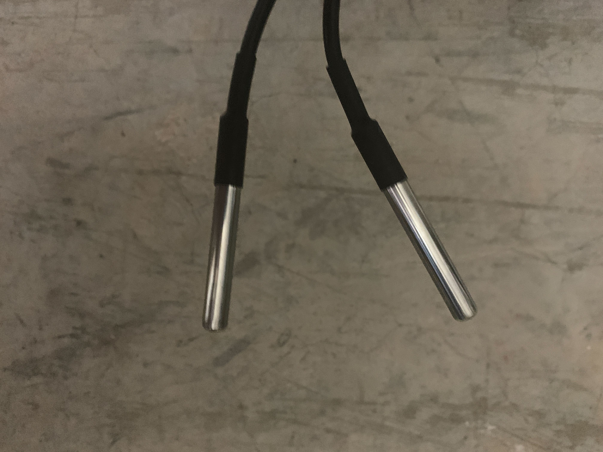
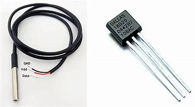
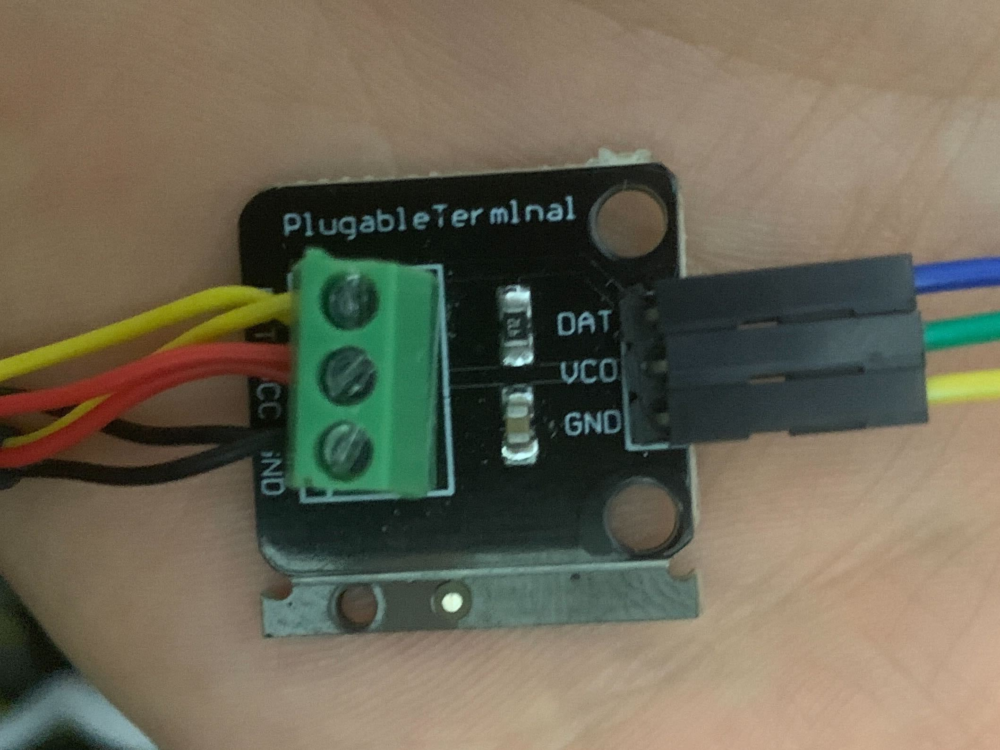
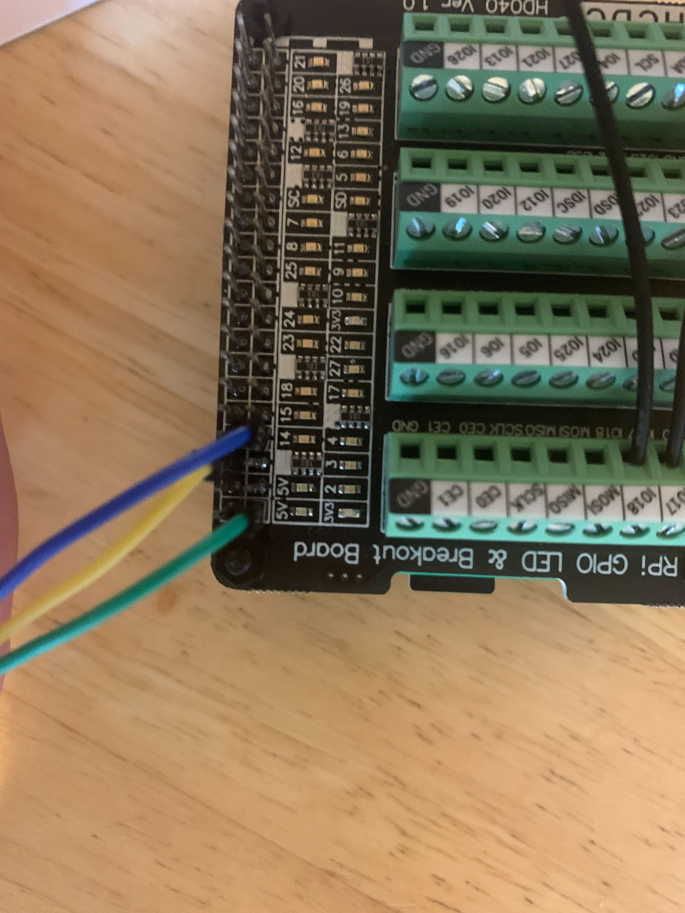
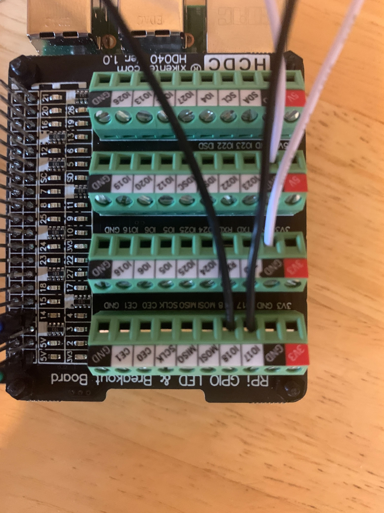
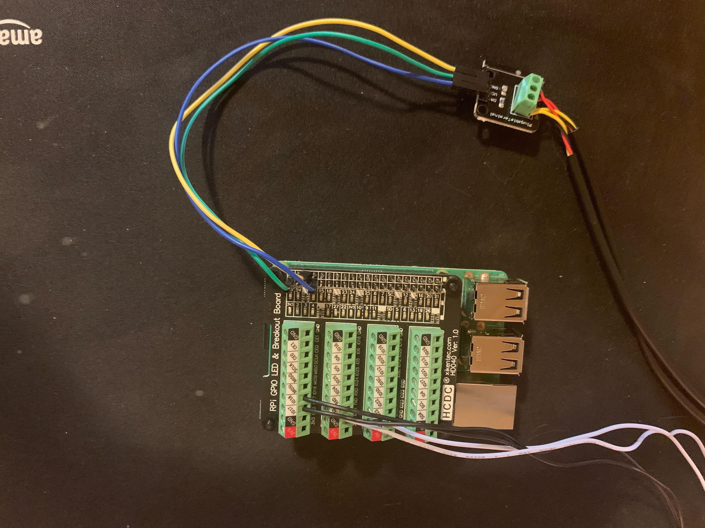

    <h1 align="center"><b>MonitorPi</b></h1>
    <h2 align="center"> A physical monitoring system built on the Raspberry Pi </h2>
    
This repository contains content from <a href="https://www.daycast.com/blog/monitorpi"> a post on the Daycast Blog</a>

    </img>

## Overview

MonitorPi is based on a set of Python 3 scripts that interact with sensors via the Raspberry Pi GPIO pins. The sensors used include: 
1. [DS18B20](https://datasheets.maximintegrated.com/en/ds/DS18B20.pdf)
2. [Magnetic Reed Switch](https://en.wikipedia.org/wiki/Reed_switch)

## Temperature Sensor

    </img>

The temperature sensor uses the DS18B20 temperature and humidity sensor. 

    </img>

This sensor needs a resister to pull up the voltage. The sensor communicates using the 1wire protocol. Since this protocol uses a bus, we can simply plug as many sensors as we need into the resistor slot provided with the sensors. 

    </img>

After the sensor is wired, the 1wire protocol can be enabled. 

`sudo modprobe w1-gpio`

`sudo modprobe w1-therm`

Once 1wire has been enabled, sensor data can be accessed at `/sys/bus/w1/devices/`

The script to enable data access can be found at [scripts/temp.py](scripts/temp.py).

To set up the script, enter the following command and enter the two results that start with `28-*` on separate lines in a text file called `config.txt`. 

`ls /sys/bus/w1/devices/`

Once you have created the config file `config.txt` in the same directory as the python script, you can run it with `python3 temp.py` The output should look something like this:
`["79.5866", "79.1366"]`

    </img>

## Contact Sensor

The wiring for the contact sensor is very simple. The white wire from the sensor is wired into a ground GPIO pin. The black wire is connected to a numbered GPIO pin. The second sensor is wired in the same way with the black wire in the next consecutive data pin and the white wire going to any open ground. As long as there are more pins, more sensors can always be connected. Wire the first pin to the sensor at the front door of the rack, wire the second pin to the back door. This is enables the proper logic for the camera system.

The script to enable data access can be found at [scripts/door.py](scripts/door.py). 

    </img>

## Camera System
The Monitor Pi can be configured to take a picture with a USB or build-in webcam when the door sensor is triggered. This system utilizes the `cam.ps1` script. The best way to set this up is to run `install.sh`. Before running, you must uncomment the camera section of `setup.ps1` This creates a system service that runs on startup. If any of the door sensors are triggered, the script takes a picture and places it in `~/img/<date>.jpg`. Sensor0 (second pin) should be wired as the front, Sensor1 (first pin) should be wired as the back. 

## Zabbix Monitoring

Zabbix can be integrated with these sensors, providing instant alerts to environment changes. 
The integration is made possible with User Parameters. This alert method uses predefined scripts in the Zabbix Agent configuration file to run scripts present on the agent system.

### Zabbix Setup Steps
1. Install the Zabbix Agent
2. Join to Zabbix -- by network discovery or manual setup

#### Manual Setup
3. Edit the Zabbix Agent config file at `/etc/zabbix/zabbix_agentd.conf`. Add a user parameter for both the temperature sensor and the door sensor. 
 - `UserParameter=temp.pull[*], python3 /home/pi/temp.py`
 - `UserParameter=door.status[*], python3 /home/pi/door.py`
4. Restart the Zabbix Agent. `sudo service zabbix-agent restart`
5. You should now be able to access the `temp.pull[]` and `door.status[]` variables from the Zabbix server. 

#### Automatic Setup
3. Run `install.sh`. This will add the user parameters to Zabbix. 
## The Finished Product

    </img>

